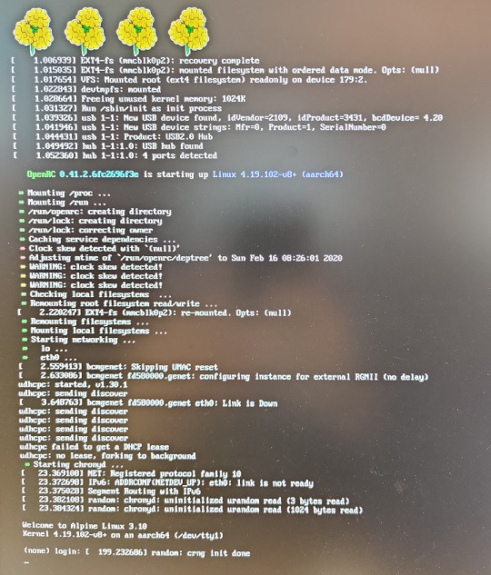

# Genepi


Genepi is a 64 bit Linux distribution for Raspberry Pi 4 based on Alpine Linux.

## Build it

This is a docker based build system assembling Raspberry Pi Kernel and Alpine linux. 

Generated Raspberry Pi 4 image is ready to burn to an SD card via [balenaEtcher](https://www.balena.io/etcher/)

The image automatically setup and configures:

* root user
* ethernet
* wifi
* bluetooth
* chronyd
* openssh server
* root partition auto-expand
* GPIO

To build Genepi, launch 

``` 
docker-build-kernel && docker-build-linux 
``` 

## It works



## Informations

[Rapsberry Pi Kernel building](https://www.raspberrypi.org/documentation/linux/kernel/building.md).

[Alpine Linux](https://alpinelinux.org/).

Many thanks to Clara for Genepi Logo copyrighted in [CC-by-NC-SA](https://creativecommons.org/licenses/by-nc-sa/3.0/).
